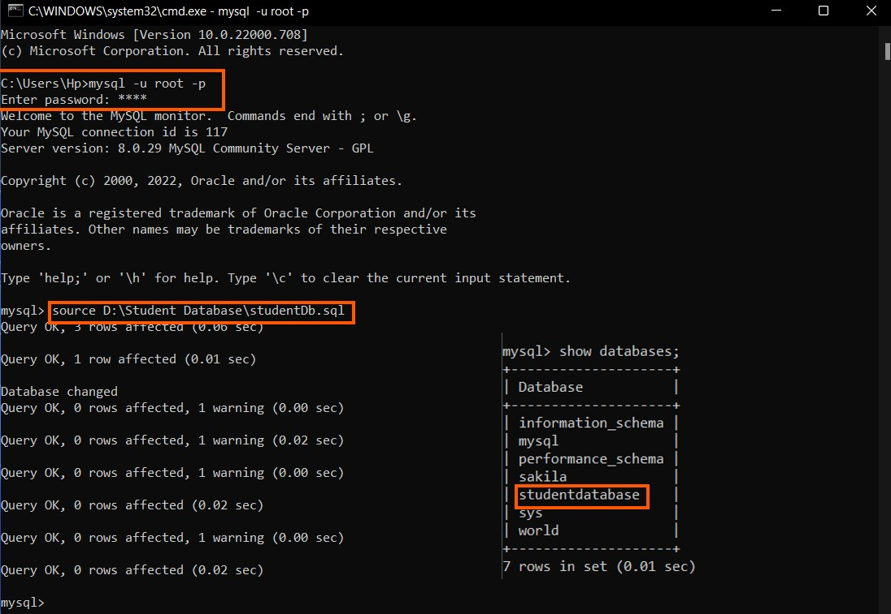

# MysqlPythonConnection</h3>


### About The Project
MySQL Connector Python is used to access MySQL databases from Python using this repo. 
Student databases will be utilized in this project.

### Features

main.py program will be able to
1. Insert Book
2. Insert Student
3. Insert Borrowing

Step 1 : Run studentDb.sql file in command prompt.
- How to Run MySQL 
  ```sh
  mysql -u root -p
  ```
	 	 
- Give the path of .sql file as:
  ```sh
  mysql> source <sql Path.sql>
  ```	

<div align="center">
  <a href="https://github.com/othneildrew/Best-README-Template">
    
  </a>
</div>
Step 2: Run main.py file

