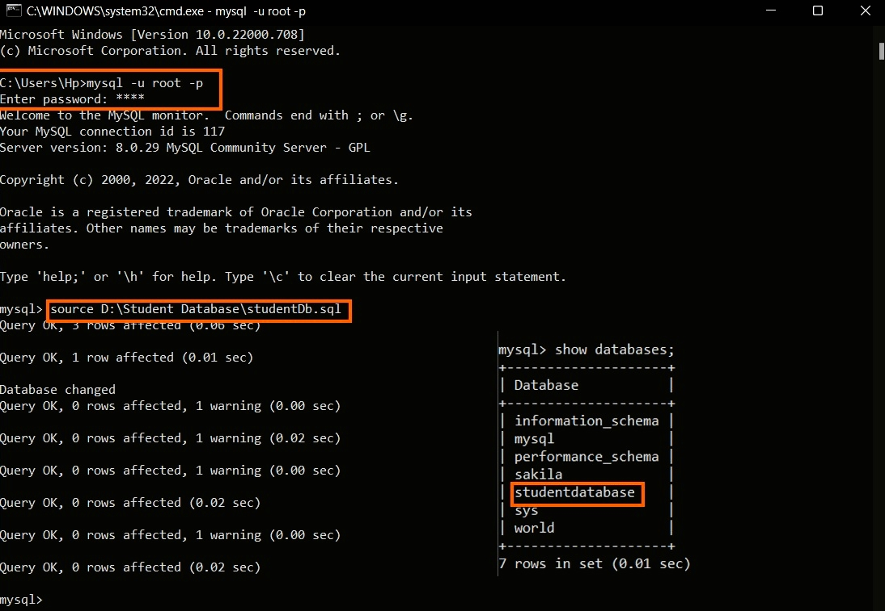

# MysqlPythonConnection

<div align="center">
	<p align="center">
	    An awesome README template to jumpstart your projects!
	    <br />
	    <a href="https://github.com/othneildrew/Best-README-Template"><strong>Explore the docs »</strong></a>
	    <br />
	    <br />
	    <a href="https://github.com/othneildrew/Best-README-Template">View Demo</a>
	    ·
	    <a href="https://github.com/othneildrew/Best-README-Template/issues">Report Bug</a>
	    ·
	    <a href="https://github.com/othneildrew/Best-README-Template/issues">Request Feature</a>
  	</p>
</div>
MySQL Connector Python is used to access MySQL databases from Python using this repo. 

### Features

- main.py program will be able to 
	- 1-> Insert Book
	 -2-> Insert Student
	 -3-> insert Borrowing

Step 1 : Run studentDb.sql file in command prompt.
- How to Run MySQL 
  ```sh
  >> mysql -u root -p
  ```
	 	 
- Give the path of .sql file as:
  ```sh
  >> source <sql Path.sql>
  ```	

<div align="center">
  <a href="https://github.com/othneildrew/Best-README-Template">
    
  </a>
</div>
Step 2: Run main.py file

